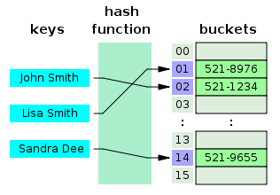

## 인덱스란?

> 인덱스(Index)는 데이터베이스의 테이블에 대한 검색 속도를 향상시켜주는 자료구조이다.

## 인덱스의 종류
1. hash table
    > 해시 테이블은 각각의 Key값에 해시함수를 적용해 배열의 고유한 index를 생성하고, 이 index를 활용해 값을 저장하거나 검색하게 된다. 여기서 실제 값이 저장되는 장소를 버킷 또는 슬롯이라고 한다.
    
    - 장점: 이러한 해싱 구조로 데이터를 저장하면 Key값으로 데이터를 찾을 때 해시 함수를 1번만 수행하면 되므로 매우 빠르게 데이터를 저장/삭제/조회할 수 있다. 해시테이블의 평균 시간복잡도는 O(1)이다.

        ***해시 함수에서 중요한 것은 고유한 인덱스 값을 설정하는 것이다.***   
        
        그런데 만약 "John Smith"를 해시 함수를 돌려 나온 값과 "Mang Kyu"를 해시 함수를 돌려 나온 index 값이   동일하다면 어떻게 해야 할까?    
        
        해시 테이블에서는 충돌에 의한 문제를 분리 연결법(Separate Chaining)과 개방 주소법(Open Addressing) 크게 2가지로 해결하고 있다.
        
    - 단점:  데이터의 충돌이 발생한 경우 Chaining에 연결된 리스트들까지 검색을 해야 하므로 O(N)까지 시간복잡도가 증가할 수 있다.    
    (통계적으로 해시 테이블의 공간 사용률이 70% ~ 80%정도가 되면 해시의 충돌이 빈번하게 발생하여 성능이 저하되기 시작한다고 한다.)
2. B+ Tree
    > 다시 업데이트 
3. Full Text
    > https://www.essential2189.dev/db-performance-fts
    > LIKE를 사용해 문자열을 검색할 때마다 인덱스를 이용하진 않는다.
    따라서 인덱스를 설정해줌으로써 검색을 할 때마다 인덱스를 이용해 성능향상을 얻을 수 있다. 
 
4. RTree
    > R-트리는 공간 데이터를 다루는 데 사용되는 트리 구조입니다.
    주로 지리 정보 시스템(GIS)과 같은 공간 데이터베이스에서 사용됩니다.
    R-트리는 다차원 공간에서 빠르게 데이터를 검색하고 인덱싱하는 데 효과적입니다.
    주어진 공간 범위 내에 있는 객체(예: 지리적 위치)를 검색하거나 근접한 객체를 찾는 데 사용됩니다.
    
## 인덱스 설정 정차 및 기준 

    1. 프로그램 개발에 이용된 모든 테이블에 대하여 접근 경로(Access Path) 조사
    
> 프로그램에 사용된 모든 질의문의 테이블을 조사하고 해당 테이블의 접근 경로를 표를 통하여 도식화해서 표현하는 것이 좋다.

    2. 인덱스 컬럼 설정

> 접근 경로 표를 기준으로 어떤 컬럼이 자주 사용되는 지를 판단하고 해당 컬럼의 분포도를 조사해야 한다.  
분포도란 Cardinality라고 하며 한 컬럼에 얼마나 다양한 값이 어떻게 분포되어 있는 지를 나타낸다.

    3. Critical Access Path

> 반복적으로 사용되는 컬럼들을 Critical Access Path라 하며, 이러한 컬럼들은 시스템 단위의 수행 속도에 많은 영향을 준다.

    4. 인덱스 컬럼의 조합 및 순서결정

> 분포도가 좋지 않은 컬럼들을 결합하여 분포도가 개선  
  분포도가 좋은 컬럼들이 각각 인덱스로 구성

  5. 시험 생성 및 테스트

> 각종 오브젝트의 파라미터를 결정(Storage 파라미터를 적절하게 결정)
- Index tablespace와 Data tablespace 분리

## 쿼리 최적화
> 쿼리를 최적화 하는 일반적인 7가지 방법

> https://medium.com/watcha/%EC%BF%BC%EB%A6%AC-%EC%B5%9C%EC%A0%81%ED%99%94-%EC%B2%AB%EA%B1%B8%EC%9D%8C-%EB%B3%B4%EB%8B%A4-%EB%B9%A0%EB%A5%B8-%EC%BF%BC%EB%A6%AC%EB%A5%BC-%EC%9C%84%ED%95%9C-7%EA%B0%80%EC%A7%80-%EC%B2%B4%ED%81%AC-%EB%A6%AC%EC%8A%A4%ED%8A%B8-bafec9d2c073

## 캐싱 
> Mysql에서의 캐싱은 권장하지 않는 것으로 보인다. 
다만, master-slave 구조를 가지고 master에서는 쓰기와수정, slave에서는 read만 수행하는 형태로 두어 
역할을 이분화 하자. 이러한 방식으로 SPOF를 피할 수 있다. DB의 수평적 확장을 Sharding(샤딩) 이라고도 한다.