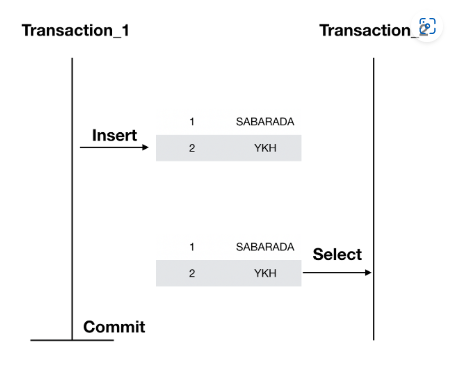
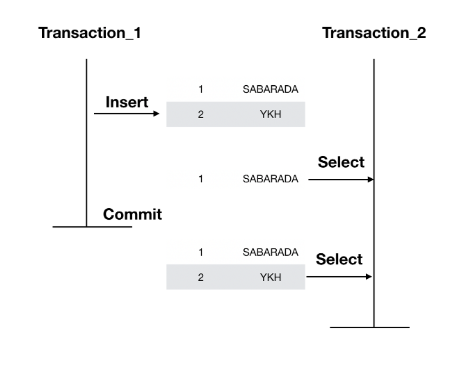

> 트랜잭션을 사용하는 목적
data를 insert 도중 에러 발생시, 사용자가 한 행동을 취소할 수 있게 도와주는 목적으로 사용된다.

> 트랜잭션 단위는 나눠지지 않는 최소한의 단위이다.

> 트랜잭션의 4가지의 특성

- 원자성
> 최소한의 단위이므로, 전부 처리되거나 아예 하나도 처리되지 않아야 한다.

- 일관성
> 일관된 상태의 데이터베이스에서 하나의 트랜잭션을 성공적으로 완료하고 나면 그 데이터베이스는 여전히 일관된 상태여야 한다.

- 격리성
> 실행 중인 트랜잭션의 중간 결과를 다른 트랜잭션이 접근할 수 없다.

- 영속성
> 트랜잭션이 성공하게 되면 그 결과는 데이터베이스에 영속적으로 저장된다.

## 격리성으로 나타날 수 있는 문제점 
> Dirty Read, Non-Repeatable Read, Phantom Read

## Dirty Read
> 다른 트랜잭션에 의해 수정됐지만 아직 커밋되지 않은 데이터를 읽는 것을 말한다.

## Non-Repeatable Read
> 한 트랜잭션 내에서 같은 key를 가진 row를 두 번 읽었는데 그 사이에 값이 변경되거나 삭제되어 결과가 다르게 나타나는 현상.

## Phantom Read
> 한 트랜잭션 내에서 같은 쿼리를 두 번 수행했는데, 첫 번째 쿼리에서 없던 유령 레코드가 두 번째 쿼리에서 나타나는 현상.

여기서 Phantom Read와 Non-Repeatuable Read를 햇갈릴 수 있는데, Non-Repeatable Read는 1개의 Row의 데이터의 값이 변경되는 것이며 Phanton Read는 다건을 요청하는 것에 대해서 데이터의 값이 변경되는 것.

# 격리성 수준

## Read Uncommitted
트랜잭션에서 처리 중인 아직 커밋되지 않은 데이터를 다른 트랜잭션이 읽는 것을 허용합니다. 해당 수준에서는 Dirty Read, Non-Repeatable Read, Phantom Read가 일어날 수 있습니다. 이 설정은 정합성에 문제가 있기 때문에 권장하는 설정은 아닙니다.

## Read Committed
트랜잭션이 커밋되어 확정된 데이터만 다른 트랜잭션이 읽도록 허용합니다. 따라서 Dirty Read의 발생가능성을 막습니다. 커밋 되지 않은 데이터에 대해서는 실제 DB 데이터가 아닌 Undo 로그에 있는 이전 데이터를 가져오는 것입니다. 하지만 Non-Repeatable Read와 Phanton Read에 대해서는 발생 가능성이 있습니다.

## Repeatable Read
트랜잭션내에서 삭제, 변경에 대해서 Undo 로그에 넣어두고 앞서 발생한 트랜잭션에 대해서는 실제 데이터가 아닌 Undo 로그에 있는 백업데이터를 읽게 합니다. 이렇게 함으로써 트랜잭션 중 값의 변경에 대해서 일정한 값으로 처리할 수 있습니다. 이렇게하면 삭제와 수정에 대해서 트랜잭션내에서 불일치를 가져오던 Non-Reapeatable Read를 해소할 수 있습니다. 

## Serializable Read
트랜잭션 내에서 쿼리를 두 번 이상 수행할 때, 첫 번째 쿼리에 있던 레코드가 사라지거나 값이 바뀌지 않음은 물론 새로운 레코드가 나타나지도 않도록 하는 설정입니다.