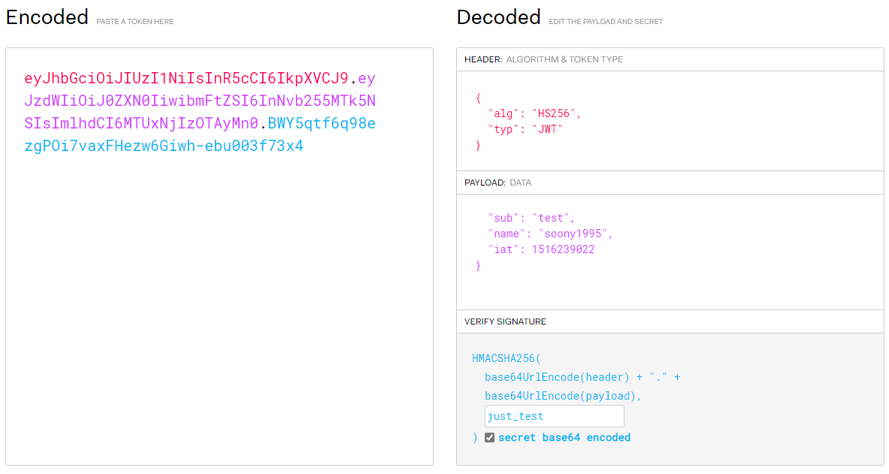

## JWT
> 인터넷 표준 인증 방식이다. 다만 JWT는 서명된 토큰이라는 점이 다릅니다. 

## JWT의 구조 
> JWT는 .을 구분점으로 총 3개의 구조로 나누어져 있습니다.
- ## Header
    ```
    {
        "typ": "JWT",
        "alg": "HS256"
    }
    JWT의 타입과 해싱알고리즘에 대한 정보가 담겨져 있습니다.
    ```
    **header가 만들어 졌으면 base64로 인코딩**
    > Base64 인코딩:   
    역할: 데이터를 안전하게 텍스트로 변환합니다.   
    사용되는 부분: JWT의 헤더와 페이로드 부분에 적용됩니다.   
    이유: JWT는 문자열로 표현되어야 하며, 다양한 시스템 간에 텍스트를 안전하게 전송할 수 있어야 합니다. Base64 인코딩은 이러한 목적으로 사용됩니다. 또한, URL에서 안전한 문자로 변환하기 위해 Base64URL 형식을 사용합니다.

    > HS256:   
    역할: 서명을 생성하거나 검증하는 데 사용되는 암호화 알고리즘입니다.  
    사용되는 부분: JWT의 서명 부분에 적용됩니다.   
    이유: JWT의 서명은 헤더와 페이로드를 함께 서명하여 데이터 무결성을 보장합니다. HS256은 HMAC-SHA256 알고리즘을 사용하여 키를 기반으로 서명을 생성하거나 검증합니다. 이 알고리즘을 사용하여 서명이 올바르게 생성되었는지 확인할 수 있으며, 서명이 변조되었는지 검증할 수 있습니다.

- ## Payload
    > 토큰에 담을 정보가 들어있는데, 담는 정보의 한 "조각"을 클레임(claim) 이라고 부릅니다. 이는 name/value의 한 쌍으로 이루어져 있습니다. 토큰에는 여러개의 클레임을 넣을 수 있습니다. 클레임의 종류에는 등록된(registered) 클레임, 공개(public) 클레임, 비공개(private) 클레임이 있습니다.
    - 등록된(registred) 클레임의 속성
        - iss: 토큰 발급자 (issuer)
        - sub: 토큰 제목 (subject)
        - aud: 토큰 대상자 (audience)
        - exp: 토큰의 만료시간 (expiraton), 시간은 NumericDate 형식으로 되어있어야 하며 (예: 1480849147370) 언제나 현재 시간보다 이후로 설정되어있어야합니다.
        - nbf: Not Before 를 의미하며, 토큰의 활성 날짜와 비슷한 개념입니다. 여기에도 NumericDate 형식으로 날짜를 지정하며, 이 날짜가 지나기 전까지는 토큰이 처리되지 않습니다.
        - iat: 토큰이 발급된 시간 (issued at), 이 값을 사용하여 토큰의 age 가 얼마나 되었는지 판단 할 수 있습니다.
        - jti: JWT의 고유 식별자로서, 주로 중복적인 처리를 방지하기 위하여 사용됩니다. 일회용 토큰에 사용하면 유용합니다.
    - 공개(pubilc) 클레임의 속성
        > 공개 클레임들은 충돌이 방지된 (collision-resistant) 이름을 가지고 있어야 합니다. 충돌을 방지하기 위해서는, 클레임 이름을 URI 형식으로 짓습니다.
        ```
        {
            "https://soony1995.com/jwt_claims/is_admin": true
        }
        ```
    - 비공개(private) 클레임의 속성
        > 양 측간에 (보통 클라이언트 <->서버) 협의하에 사용되는 클레임 이름들입니다. 공개 클레임과는 달리 이름이 중복되어 충돌이 될 수 있으니 사용할때에 유의해야합니다.
        ```
        {
            "username": "soony1995"
        }
        ```
    **payload 예시**  
    ```
    {
        "iss": "soony1995.com",
        "exp": "1485270000000",
        "https://soony1995.com/jwt_claims/is_admin": true,
        "userId": "11028373727102",
        "username": "soony1995"
    }
    ```
    **payload가 만들어 졌으면 base64로 인코딩**
- ## Signature   
    > JSON Web Token 의 마지막 부분은 바로 서명(signature) 입니다.   
    이 서명은 **헤더의 인코딩값**과, **페이로드의 인코딩값**을 합친후 주어진 비밀키로 해쉬를 하여 생성합니다.

    서명 부분을 만드는 슈도코드(pseudocode)의 구조는 다음과 같습니다.
    ```
    const signature = crypto
        .createHmac("sha256", "secret_key")
        .update(`${encodedHeader}.${encodedPayload}`)
        .digest("base64")
        .replaceAll("=", "")
    ```
    > 인코딩된 header 와 payload 를 점(.) 으로 이어 붙인 것을 sha256 알고리즘을 사용하여 HMAC으로 암호화 한다. 이 또한 Base64 로 표현하도록 설정한다. 마찬가지로 Padding 을 제거한다.

## Token 생성 
> const jwt = `${encodedHeader}.${encodedPayload}.${signature}`

<hr>
<br>

## Test
### https://jwt.io/ 사이트에 들어가면 이렇게 jwt 토큰을 encoded/decoded 할 수 있다.

