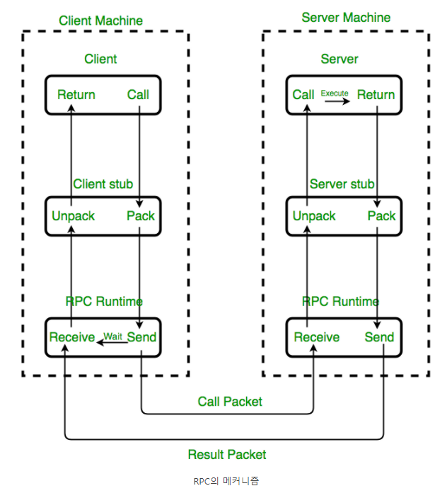
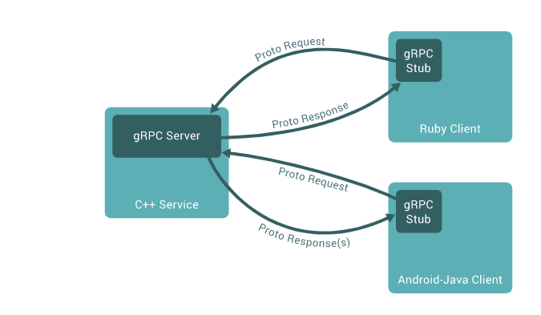

# RPC 
> 원격 프로시저 호출(영어: remote procedure call, 리모트 프로시저 콜, RPC)은 별도의 원격 제어를 위한 코딩 없이 다른 주소 공간에서 함수나 프로시저를 실행할 수 있게하는 프로세스 간 통신 기술이다.    
다시 말해, 원격 프로시저 호출을 이용하면 프로그래머는 함수가 실행 프로그램에 로컬 위치에 있든 원격 위치에 있든 동일한 코드를 이용할 수 있다.   
RPC(Remote Procedure Call)란 프로세스간 통신을 위해 사용하는 IPC(Inter Process Communication) 방법의 한 종류이다.    
말 그대로 원격지의 프로시저를 호출하는 것이다.

# RPC를 쓰는 이유
> ***MSA 구조의 서비스(개발 스택이 다양함)를 만들 때, 언어나 환경에 구애받지 않고, 비즈니스 로직을 개발하는 데에 집중할 수 있다.***   
일반적으로 프로세스는 자신의 주소공간 안에 존재하는 함수만 호출하여 실행 가능하다.   
그러나, RPC의 경우 자신과 다른 주소공간에서 동작하는 프로세스의 함수를 실행할 수 있게 해주는데, 이를 네트워크를 통한 메시징을 수행하기 때문이다.   

# RPC의 목표
> 
- 클라이언트-서버 간의 커뮤니케이션에 필요한 상세정보는 최대한 감춘다.
- 클라이언트는 일반 메소드를 호출하는 것처럼 원격지의 프로지서를 호출할 수 있다.
- 서버도 마찬가지로 일반 메소드를 다루는 것처럼 원격 메소드를 다룰 수 있다.

# RPC의 매커니즘

## 설명 

1. 클라이언트가 일반적인 방식으로 파라미터를 넘겨 client stub procedure를 호출한다. client stub은 클라이언트를 소유한 주소의 공간 내에 거주한다.

2. client stub이 파라미터들을 메세지로 모은다. 여기서 모은다는 것에 파라미터의 표현을 표준 포맷으로 변경하고 각 파라미터를 복사해서 메세지로 넣는 것도 포함된다.

3. client stub은 원격 서버 머신으로 메세지를 보내는 계층인 transport layer로 메세지를 보낸다.

4. 서버에서, transport layer는 메세지를 server stub으로 보낸다. server stub은 또 파라미터들을 모아주고 일반적인 프로시저 호출 메커니즘을 사용하여 요구된 서버 루틴을 호출한다.

5. 서버 프로시저가 완료될 때, 서버 프로시저는 server stub으로 반환된다. (이를테면 일반적인 프로시저 호출 반환값을 통해), server stub은 결과 값들을 모아서 메세지에 넣고, transport layer에 메세지를 보낸다.

6. transport layer는 결과 메세지를 다시 client transport layer로 보내고 client transport layer는 그 결과를 또 client stub에게 전달한다.

7. client stub은 반환 파라미터들과 실행 결과값을 다시 해체한다.

## 이해를 돕기 위한 그림

출처: https://velog.io/@dojun527/gRPC%EB%9E%80

### stub
Stub는 RPC의 핵심 개념으로 Parameter 객체를 Message로 Marshalling/Unmarshalling하는 레이어이다.

서버와 클라이언트는 서로 다른 주소 공간을 사용하므로 함수 호출에 사용된 매개 변수를 꼭 변환해줘야 한다. 그렇지 않으면 메모리 매개 변수에 대한 포인터가 다른 데이터를 가리키게 되기 때문이다.
 
client의 stub은 함수 호출에 사용된 파라미터의 변환(marshalling) 및 함수 실행 후 서버에서 전달된 결과의 변환 담당 

server의 stub은 클라이언트가 전달한 매개 변수의 역변환(unmarshalling) 및 함수 실행 결과 변환을 담당

### 추가 자료
https://velog.io/@ypo09/%EB%A7%88%EC%9D%B4%ED%81%AC%EB%A1%9C-%EC%84%9C%EB%B9%84%EC%8A%A4%EC%99%80-gRPC%EB%A5%BC-%ED%99%9C%EC%9A%A9%ED%95%9C-%EC%84%9C%EB%B2%84-%EA%B0%84-%ED%86%B5%EC%8B%A0-%EC%A0%81%EC%9A%A9%EA%B8%B0