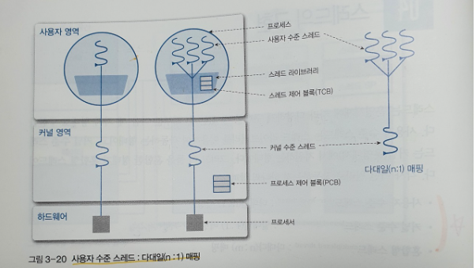
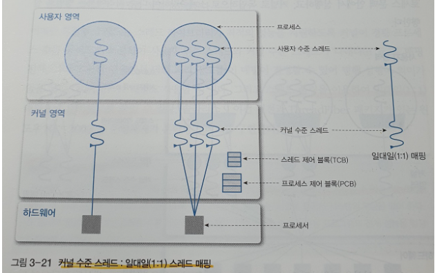
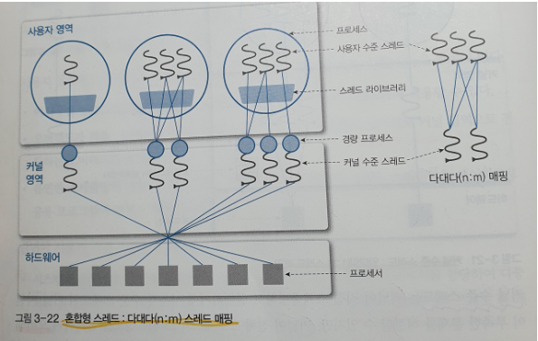

# user-level thread

- 사용자 영역에서 스레드 연산을 수행한다. 

- 사용자 영역에서 스레드 연산을 수행하기 때문에 운영체제에 투명하다. 

- 커널에 의존적이지 않은 형태로 ***스레드의 기능을 제공하는 라이브러리를 활용*** 하는 방식이 사용자 레벨(User Level) 스레드다.

### user-level thread 장점

- 운영체제에서 스레드를 지원할 필요가 없다. 

- 스케줄링 결정이나 동기화를 위해 커널을 호출하지 않기 때문에 인터럽트가 발생할 때 커널 레벨 스레드보다 오버헤드가 적다.

- 즉, 위의 말은 사용자 영역 스레드에서 행동을 하기에 OS Scheduler의 context switch가 없다(유저레벨 스레드 스케줄러를 이용).

- 커널은 사용자 레벨 스레드의 존재조차 모르기 때문에 모드 간의 전환이 없고 성능 이득이 발생한다

### user-level thread 단점

- 시스템 전반에 걸친 스케줄링 우선순위를 지원하지 않는다. (무슨 스레드가 먼저 동작할 지 모른다.)

- 프로세스에 속한 스레드 중 I/O 작업등에 의해 하나라도 블록이 걸린다면 전체 스레드가 블록된다.   

# kernel-level thread

- 커널 스레드는 가장 가벼운 커널 스케쥴링 단위다. 

- 하나의 프로세스는 적어도 하나의 커널 스레드를 가지게 된다. 

- 커널 영역에서 스레드 연산을 수행하게 된다.

- 커널이 스레드를 관리하기 때문에 커널에 종속적이다.

- 프로그래머 요청에 따라 스레드를 생성하고 스케줄링하는 주체가 커널이면 커널 레벨(Kernel Level) 스레드라고 한다.

### kernel-level thread 장점

- 프로세스의 스레드들을 몇몇 프로세서에 한꺼번에 디스패치 할 수 있기 때문에 멀티프로세서 환경에서 매우 빠르게 동작한다.

- 다른 스레드가 입출력 작업이 다 끝날 때까지 다른 스레드를 사용해 다른 작업을 진행할 수 있다. 

- 커널이 각 스레드를 개별적으로 관리할 수 있다. 

- 커널이 직접 스레드를 제공해 주기 때문에 안정성과 다양한 기능이 제공된다.

### kernel-level thread 단점

- 스케줄링과 동기화를 위해 커널을 호출하는데 무겁고 오래걸린다.(저장한 내용을 다시 불러오는 과정이 필요)

- 즉, 사용자 모드에서 커널 모드로의 전환이 빈번하게 이뤄져 성능 저하가 발생한다.

- 사용자가 프로그래밍할 때 구현하기 어렵고 자원을 더 많이 소비하는 경향이 있다.

# combined-level thread

- 혼합형 스레드는 사용자 수준 스레드와 커널 수준 스레드를 혼합한 구조이다.    
이는 시스템 콜을 할 때 다른 스레드를 중단하는 사용자 수준 스레드와 스레드 수를 제한하는 커널 수준 스레드 문제를 극복하는 방법이다.    
즉, 사용자 수준 스레드는 커널 수준 스레드와 비슷한 경량 프로세스에 다대다로 매핑되고, 경량 프로세스는 커널 수준 스레드와 일대일로 매핑된다. 

- 프로세스 하나에는 경량 프로세스가 하나 이상 있고, 경량 프로세스에는 이에 대응하는 커널 스레드가 한 개 있다. 그리고 자원과 입출력 대기를 하려고 경량 프로세스 단위로 대기하므로 프로세스는 입출력을 완료할 때까지 대기할 필요가 없다. 어떤 경량 프로세스가 입출력 완료를 기다리더라도 동일한 프로세스에서 다른 경량 프로세스를 실행할 수 있기 때문이다. 

- 혼합형 스레드는 스레드 라이브러리가 최적의 성능을 지원하도록 커널이 경량 프로세스 수를 동적으로 조절해 사용자 수준 스레드와 커널 수준 스레드가 다대다로 매핑된다. 그리고 커널 영역에서 병렬 처리 정도를 이 매핑이 결정할 수 있어 병행 실행이 의미가 없을 때는 다대일 매핑도 사용할 수 있다. 그리고 스레드 풀링을 이용해 일대일 매핑으로 오버헤드를 줄일 수 있다. 

- 스레드 풀링(thread pooling) : 시스템이 관리하는 스레드의 풀을 응용프로그램에 제공해 스레드를 효율적으로 사용할 수 있게 하는 방법
