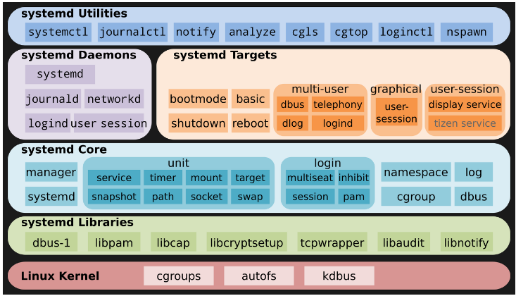
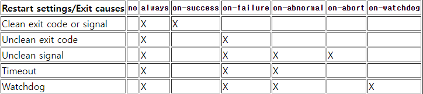

## systemd? 
> systemd은 Linux 시스템의 초기화(init) 프로세스를 대체하는 시스템 및 서비스 관리 프레임워크입니다.   
부팅과 관련된 작업을 처리하며, 시스템 레벨 타깃, 유닛(unit) 설정 등을 관리합니다.
systemd는 시스템 전반의 프로세스 관리, 의존성 해결, 로깅 등 다양한 기능을 제공합니다.   
systemd는 시스템 부팅 시 초기 프로세스인 init의 역할을 대체하면서 기존의 init을 대체하는 것이 주요 목적이었습니다.

## systemctl?
> systemctl은 systemd를 컨트롤하기 위한 명령 라인 유틸리티입니다.   
서비스(unit), 타깃(target), 소켓(socket), 마운트(mount), 타이머(timer) 등 systemd가 관리하는 유닛들의 상태를 관리하고 조작하는 역할을 합니다.   
시스템 부팅 시 실행되는 서비스를 시작, 중지, 재시작하는 등 다양한 작업을 수행합니다.   
systemctl은 특정 서비스나 유닛에 대한 상태 확인, 제어, 로깅 등을 수행하는데 사용됩니다.

요약하자면, systemd는 전체적인 ***시스템 관리 프레임워크로서 시스템 부팅 및 서비스 관리, 의존성 처리 등을 담당***하며,    
systemctl은 ***systemd를 조작하고 관리하기 위한 명령어 도구***입니다.    


 ***systemd(System daemon)은 시스템 부팅 시 가장 먼저 생성된 후 다른 프로세스를 실행하는 init 역할을 대체한다.***

## 1. .service 파일 options
service 섹션 중에서 restart에 관해서 다루기로 한다.


> [no | on-success | on-failure | on-watchdog | on-abort | always ]

### no(기본값)
  - 유닛을 다시 시작하지 않는다.

### on-success
  - 유닛이 정상적으로 종료되었을 때만 재시작한다.
  - 종료시에 "0" 값을 리턴하여 종료되었거나
  - SIGHUP, SIGINT, SIGTERM, SIGPIPE 등과 같은 시그널
  - "SuccessExitStatus=" 설정에서 지정된 리턴 코드 목록에 따른 시그널에 대해서 모두 성공으로 인식해 재시작을 하게 된다.

### on-failure
  - 유닛이 비정상적으로 종료되었을때 재시작한다.
  - 리턴값이 "0" 이 아닌 경우,
  - core dump 와 같이 비정상적인 시그널을 받고 종료된 경우,
  - 타임 아웃값내 응답이 없는 경우 등일때 재시작 하게 된다.

### on-watchdog
  - "WatchdogSec=" 에 설정된 시간내 응답이 없는 경우에만 재시작 한다.

### on-abort
  - 지정되지 않은 리턴값을 받은 경우 재시작을 한다.

### always
 - 종료 상태 등과 무관하게 무조건 재시작한다.
 - 사용자가 중지해도 시스템이 다시 띄우게 된다.


> 장기 실행되는 서비스의 경우 on-failure로 설정하는 것이 오류로부터 자동 복구를 시도하여 신뢰성을 높이는 권장되는 선택입니다. 자체적으로 종료될 수 있어야 하는 서비스의 경우 on-abnormal이 대체 옵션입니다.

## 2. 적용
> sudo systemctl daemon-reload 

으로 system ctl 변경사항을 적용시키기 위해서 재시작 해주자.


## 예시)
```
[Unit]
Description= soony1995 server 
After=network-online.target  
Wants=network-online.target
 
[Service]
Type=simple
#User=nimbus
#Group=nimbus
ExecStartPre=/bin/cp /dev/null /opt/janus/etc/janus/janus.plugin.streaming.jcfg
ExecStart=/opt/janus/bin/janus -o
ExecStopPost=/bin/bash /opt/janus/bin/relay-clear.sh
Restart=on-abnormal
LimitNOFILE=65536
 
[Install]
WantedBy=multi-user.target
```

### [Unit] 섹션: 
> 이 섹션은 서비스 유닛의 메타데이터와 동작을 정의.
- Description: 이 서비스 유닛에 대한 간단한 설명을 제공. 이 경우 "soony1995 server"로 정의.
- After: 이 서비스가 시작되기 전에 완료되어야 하는 타깃을 정의. 이 경우 network-online.target을 지정하여 네트워크가 온라인 상태가 되어야만 이 서비스가 시작.
- Wants: 이 서비스가 원하는(의존하는) 유닛을 정의. 위의 설정에서는 network-online.target을 원하므로, 해당 유닛이 활성화될 때까지 대기.

### [Service] 섹션: 
> 이 섹션은 서비스의 실행 방법과 동작을 정의.
- Type: 이 서비스의 실행 형태를 지정. simple은 단순한 프로세스를 실행하는 형태.
- ExecStartPre: 서비스 메인 프로세스 실행 이전에 실행되는 명령을 정의. 이 예시에서는 /opt/janus/etc/janus/janus.plugin.streaming.jcfg 파일을 비움.
- ExecStart: 실제 서비스의 메인 프로세스를 실행하는 명령을 정의. /opt/janus/bin/janus -o는 Janus 서비스를 실행하는 명령.
- ExecStopPost: 서비스가 중지된 후 실행되는 명령을 정의. /opt/janus/bin/relay-clear.sh 스크립트를 실행.
- Restart: 이 설정은 서비스의 재시작 동작을 정의. on-abnormal로 설정되어 있으므로, 비정상적인 신호 또는 시간 초과 등으로 인해 서비스가 종료되면 다시 시작.
- LimitNOFILE: 서비스에 할당되는 최대 파일 디스크립터(파일 핸들) 개수를 제한. 이 예시에서는 65536으로 설정.

### [Install] 섹션:
> 이 섹션은 서비스를 어떤 시스템 레벨 타깃에 설치할지 정의.
- WantedBy: 이 서비스가 활성화되는 타깃을 정의. multi-user.target은 일반적인 다중 사용자 모드에서의 기본 타깃. 따라서 시스템이 부팅될 때 이 서비스가 활성화.

출처: https://passwd.tistory.com/entry/Ubuntu-Systemd-service-%EB%93%B1%EB%A1%9D


### service 파일을 저장하는 위치:
- /etc/systemd/system │ Local configuration         

  > 시스템의 루트 파일 시스템에 위치하는 디렉토리입니다.  
  주로 시스템 패키지에서 제공하는 시스템 레벨의 systemd 서비스와 유닛 파일을 저장합니다.   
  시스템 패키지 업데이트 중에 업데이트될 수 있습니다. (시스템 업데이트에 따라 덮어씌워질 수 있음)
  시스템 전반에 걸쳐 사용되는 서비스와 유닛의 기본 설정이 포함됩니다.
- /run/systemd/system │ Runtime units               
  > 런타임에 생성된 Systemd unit files.
- /lib/systemd/system │ Units of installed packages
  > 시스템 설정을 위한 디렉토리입니다.   
시스템 관리자 또는 사용자가 직접 커스텀 서비스와 유닛 파일을 추가하고 수정할 수 있습니다.   
시스템 패키지에 의해 덮어씌워지지 않습니다. (시스템 업데이트에 영향을 받지 않음)    
시스템 전반 또는 특정 사용자 또는 애플리케이션에 대한 커스텀 서비스와 유닛 설정을 관리하는 데 사용됩니다.