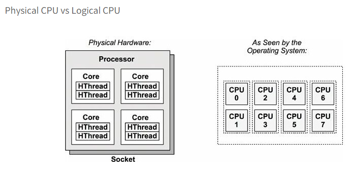

## processor, cpu, hardware thread
- processor : 소켓에 장착되는 물리적인 chip. processor안에는 다수의 core와 hardward thread가 존재한다.
- core : 멀티코어 프로세서의 독립적인 CPU 인스턴스이다.
- hardware thread: 한 개의 코어 내에서 multiple thread를 동시에 실행가능한 CPu 아키텍처에서 각 thread는 독립적인 CPU instance로 가능하다. 


출처: https://etloveguitar.tistory.com/62
## 서버 CPU 사양 확인

> lscpu

```
Architecture:        x86_64
CPU op-mode(s):      32-bit, 64-bit
Byte Order:          Little Endian
CPU(s):              2  -> 2 processor * 1 core * 1 thread  
On-line CPU(s) list: 0,1
Thread(s) per core:  1 -> 1 thread 
Core(s) per socket:  1 -> 1 core
Socket(s):           2 -> 2processor 
NUMA node(s):        1
Vendor ID:           GenuineIntel
CPU family:          6
Model:               85
Model name:          Intel(R) Xeon(R) Gold 6132 CPU @ 2.60GHz
Stepping:            4
CPU MHz:             2594.076
BogoMIPS:            5187.84
Hypervisor vendor:   Microsoft
Virtualization type: full
L1d cache:           32K
L1i cache:           32K
L2 cache:            1024K
L3 cache:            19712K
NUMA node0 CPU(s):   0,1
Flags:               fpu vme de pse tsc msr pae mce cx8 apic sep mtrr pge mca cmov pat pse36 clflush acpi mmx fxsr sse sse2 syscall nx pdpe1gb rdtscp lm constant_tsc rep_good nopl cpuid tsc_known_freq pni pclmulqdq ssse3 fma cx16 pcid sse4_1 sse4_2 x2apic movbe popcnt tsc_deadline_timer aes xsave avx f16c rdrand hypervisor lahf_lm abm 3dnowprefetch cpuid_fault invpcid_single pti intel_ppin ssbd ibrs ibpb stibp fsgsbase tsc_adjust bmi1 hle avx2 smep bmi2 erms invpcid rtm mpx rdseed adx smap clflushopt clwb xsaveopt xsavec xgetbv1 xsaves pku ospke md_clear flush_l1d
```