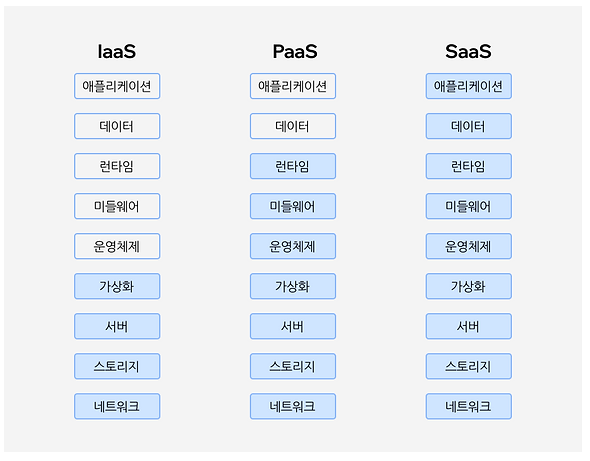

1. saas
2. ETL 

> saas

## SaaS는 Soft되ware as a Service를 뜻하며 서비스형 소프트웨어로 알려져 있습니다. 즉, 소프트웨어를 기기에 설치하지 않고 온라인으로 액세스할 수 있는 소프트웨어 라이센스 및 제공 수단을 의미합니다. SaaS 모델에서는 모든 소프트웨어 및 해당되는 데이터가 공급자의 서버에서 호스팅기 때문에 공급자에게는 애플리케이션의 보안, 가용성, 업데이트 및 성능을 관리할 책임이 있습니다.
SaaS는 일반적으로 사용자가 로그인 이름과 비밀번호는 물론 유효한 월간/연간 결제 플랜이 필요한 구독 가입 기반의 형태로 제공됩니다. SaaS 솔루션은 호스팅 소프트웨어, 주문형 소프트웨어 및 웹 기반 소프트웨어라고도 합니다. 

IaaS

IaaS는 쉽게 말해서 가상의 네트워크 공간을 사용하여 서버를 제공하는 서비스입니다. 서버와 저장하는 공간, 방화벽 그리고 실제 데이터 센터 등을 통해서 인프라가 없어도 되는 서비스입니다. IaaS에서는 사용자가 애플리케이션, 데이터, 런타임, 미들웨어, 운영체제를 다룹니다. 그리고 서비스 공급자는 가상화, 서버, 스토리지, 네트워크를 제공합니다. 

PaaS

PaaS에서 사용자는 애플리케이션과 데이터를 다루고 이 외에 나머지는 서비스 공급자가 제공합니다. 즉, 개발할 수 있는 환경이 이미 구축되어 있기 때문에 인프라에 대한 걱정 없이 개발을 할 수 있다는 특징이 있습니다. 

SaaS

SaaS에서는 서비스 공급자가 애플리케이션, 데이터, 런타임, 미들웨어, 운영체제, 가상화, 서버, 스토리지, 네트워크까지 모두 제공한다는 특징이 있습니다. 

> ETL

ETL이란 무엇인가요?
추출, 전환, 적재(ETL)는 다양한 소스의 데이터를 데이터 웨어하우스라고 부르는 대형 중앙 집중식 리포지토리에 결합하는 과정입니다. ETL은 원시 데이터를 정리 및 구성해서 스토리지, 데이터 분석, 기계 학습(ML)용으로 준비하기 위한 비즈니스 규칙 세트입니다. 사용자는 데이터 분석(비즈니스 의사 결정의 결과 예측, 보고서 및 대시보드 생성, 운영 비효율성 저감 등)을 통해 특정 비즈니스 인텔리전스 요구 사항을 해결할 수 있습니다.