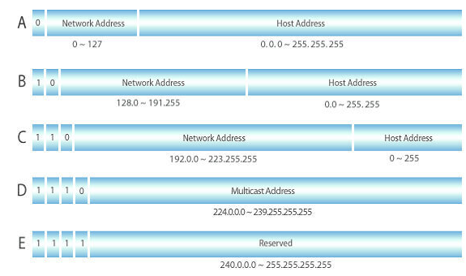
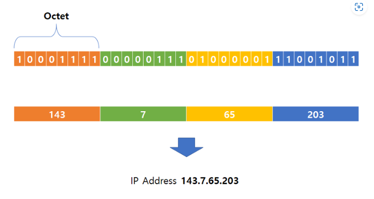

> CIDR의 full name은 Classless Inter-Domain Routing 으로 클래스 없는 도메인간 
라우팅 기법이라는 뜻입니다.

> Class는 사이더가 나오기전 사용했던 네트워크 구분 체계 입니다.

> 아래 그림과 같이 하나의 옥텟은 8비트로 이루어져 있으며 일반적으로 사용하는 IPv4 주소는 4개의 옥텟으로 이루어져 있습니다. 따라서 사이더는 0~32 까지 총 32비트까지 사용가능 합니다. 

CIDR이 "/24" 라면 아래 그림과 같이 앞에서부터 24비트 이후에 오는 4번째 옥텟(파란색 부분)을 전부 사용할 수 있다는 표현입니다
 

하나의 옥텟은 8비트로 2의8승 인 256개 이기 때문에,  143.7.65.203/24 일때 143.7.65.0 ~ 143.7.65.255 까지 사용이 가능한 것이죠.

더 자세한 설명 : https://kim-dragon.tistory.com/9
