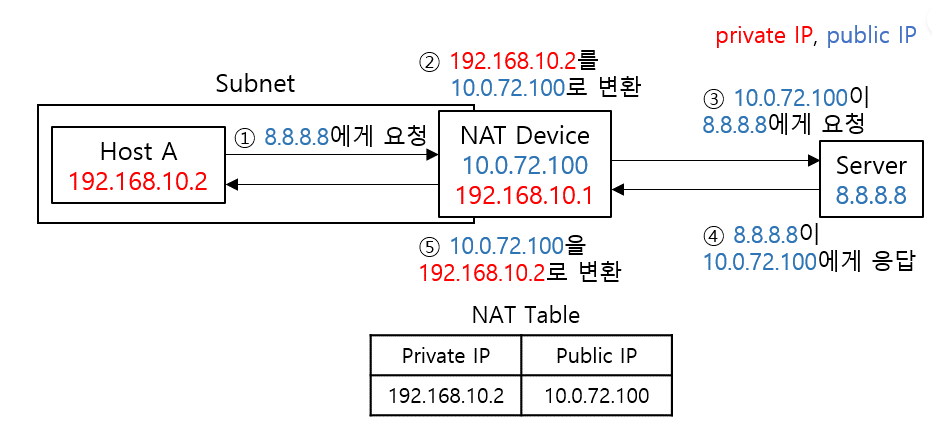

## NAT (Network Address Translation)
> IP 패킷에 있는 출발지 및 목적지의 IP 주소와 TCP/UDP 포트 숫자 등을 바꿔 재기록하면서 네트워크 트래픽을 주고 받게 하는 기술.

> Private Network에서 사용 가능한 Private IP  
10.0.0.0 ~ 10.255.255.255   
172.16.0.0 ~ 172.31.255.255   
192.168.0.0 ~ 192.168.255.255   

## 사용하는 이유   
### 1. IP 주소 절약
### 2. 보안

## NAT의 종류
### 1. static nat
    - private IP : public IP 1:1로 매핑 됨
    - IP 절약 효과는 없다.     

***1:1 매핑이기 때문에 외부에서 내부로의 접근도 가능하다.***

    
### 2. dynamic nat
    - private IP < public IP 일 때, 랜덤으로 매핑 해준다.
    - 고정적으로 IP 를 매핑해 줄 필요가 없기 때문에 IP가 계속 달라진다.
### 3. pat nat (port address translation)
    - private IP > public IP 일 때, IP 주소는 한정 되어 있기 때문에 하나의 IP 주소에서 port번호로 각각의 private IP를 구분.

## NAT의 타입
### 1.Full Cone NAT

- 가장 개방적인 형태의 NAT 방식으로 외부 네트워크 누구든지 NAT 장비에 매핑된 Public IP:Port로 접근 시 내부 네트워크 Host에 통신을 시도할 수 있다.
### 2.Restricted Cone NAT

- 이전에 Host가 외부로 데이터를 전송한 적이 있는 ip만 허용한다. 따라서, Server B처럼 통신한 적이 없는 주소로부터 패킷을 받으면 드랍한다. 다만 Server A의 경우 통신한 적이 있기에 다른 포트인 Service a, b는 일방적으로 Host에게 패킷을 전송할 수 있게 된다.
### 3.Port Restricted Cone NAT

- Restricted Cone NAT와 비교해서 Port까지 제한사항이 생겼다. 말 그대로 이전에 통신하던 IP 주소와 Port가 일치해야만 패킷을 수신하겠음을 의미한다. 즉, 기존에 통신하던 Service가 아니면 모든 Service는 일방적으로 Host에게 패킷을 보낼 수 없는 환경임을 의미한다.
### 4.Symmetric NAT

- Symmetric NAT는 연결된 Destination에 따라 다른 외부 IP:Port로 매핑된다는 특징을 갖는다. 외부 네트워크 통신에서의 제약사항은 Port Restricted Cone NAT와 동일하게 적용된다. 다만, Host의 Private NAT에 대해 NAT 장비가 매핑하는 정보가 통신 대상에 따라 달라진다.

## 타입에 따른 제약 사항 
### 포트포워딩
## 내 NAT 장비 타입 확인하기 
