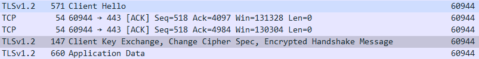

## wireshark를 이용해 패킷을 들여다 보자

### https

> https의 경우 패킷의 내용을 볼 수 없다. 


위의 형태로 패킷이 암호화 되어 있어 들여다 볼 수 없다.

### http 
> http의 경우 패킷의 내용을 볼 수 있다.

```
GET /metrics HTTP/1.1
Host: 172.27.0.45:9117
User-Agent: Prometheus/2.1.0+ds
Accept: text/plain;version=0.0.4;q=1,*/*;q=0.1
Accept-Encoding: gzip
X-Prometheus-Scrape-Timeout-Seconds: 10.000000

HTTP/1.1 200 OK
Content-Encoding: gzip
Content-Type: text/plain; version=0.0.4; charset=utf-8
Date: Wed, 30 Aug 2023 08:13:15 GMT
Content-Length: 2022
```
안을 들여다 보면 이렇게 구성 되어 있다.

### http vs tcp

계층 위치:

HTTP: HTTP는 응용 계층 프로토콜로, 웹 브라우저와 웹 서버 사이의 데이터 통신을 처리합니다.
TCP: TCP는 전송 계층 프로토콜로, 다양한 응용 프로토콜(예: HTTP, FTP, SMTP)에서 사용되며, 데이터의 신뢰성과 순서 보장을 담당합니다.

목적:
HTTP: HTTP는 웹 페이지, 이미지, 동영상 등의 하이퍼텍스트 문서와 미디어 리소스를 웹 브라우저와 웹 서버 간에 전송하기 위해 설계되었습니다.
TCP: TCP는 데이터 전송을 위한 일반적인 프로토콜로, 어떤 종류의 데이터든 안정적으로 전송할 수 있도록 해줍니다.

연결 유지 여부:
HTTP: HTTP는 기본적으로 연결 지향적이지 않습니다. 즉, 각 요청에 대해 새로운 연결을 맺고 닫을 수 있습니다.
TCP: TCP는 연결 지향적인 프로토콜로, 데이터를 주고받기 위해 연결을 설정하고, 데이터 전송이 완료되면 연결을 종료합니다.

헤더와 데이터:
HTTP: HTTP는 요청과 응답 메시지로 구성되며, 이들 메시지에는 헤더와 본문(데이터)이 포함됩니다. 헤더에는 요청 또는 응답에 대한 메타데이터가 포함되고, 본문에는 실제 데이터가 들어갑니다.
TCP: TCP는 흐름 제어, 오류 검출 및 복구와 같은 기능을 제공하기 위한 정보를 포함하는 헤더와 데이터를 단순히 전송하는 역할을 합니다. TCP 자체는 헤더 및 데이터 구분을 하지 않습니다.

-chatGPT 답변

> http는 3way-handshaking을 하지 않는다. 

### tcp 프로토콜이 keepalive를 하는 이유
> tcp 연결이 설정된 이후에 fin 메시지를 송수신 한 후에 연결이 해제되야 하지만 오류에 의해서 연결이 유지되는 상황을 방지하기 위함.   
keepalive 타이머를 이용해 연결이 해제된 이후 지정한 시간동안 keepalive    interval마다 패킷을 보내 응답이 없으면 연결을 해제한다. 