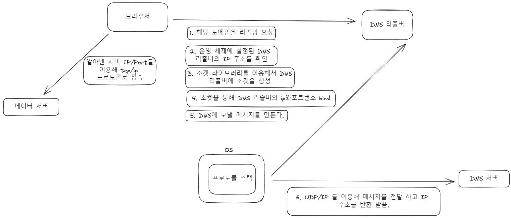
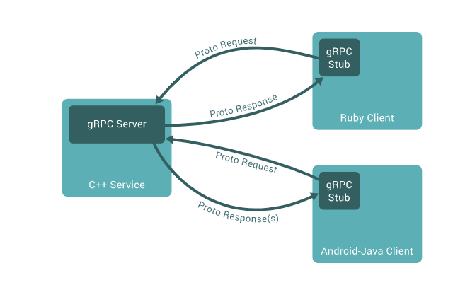

# 사용자가 브라우저창에 도메인을 검색하면 발생하는 일

### KEYWORD
- DNS 서버 
    -  
- URI, URL
- 소켓
- 디스크립터
- 프로토콜 스택

   
 

#### 1. 사용자가 브라우저창에 도메인을 검색한다.  
#### 2. 브라우저는 도메인에 해당하는 IP주소를 DNS 서버에 요청을 보낸다.    
#### 3. DNS 서버는 상위 도메인을 관리하는 서버 부터 하위 도메인을 관리하는 서버까지 요을 하면서 해당 IP 주소를 알아낸다.   
#### 4. 알아낸 IP 주소를 이용해 사용자가 원하는 메시지를 서버에 보내려고 함.
#### 5. 브라우저는 서버에 보내는 기능은 수행할 수 없기 때문에 OS내부에 있는 프로토콜 스택을 호출한다.
#### 6. TCP/UDP를 통해서 패킷을 보낸다.

< 정리 >

1. 사용자가 url 주소를 입력하게된다.

2. 브라우저는 사용자가 보내온 url 정보를 브라우저 내에 있는 리졸버를 실행.

3. 리졸버는 OS안에 있는 프로토콜 스택을 이용해 해당 도메인으로 등록되어 있는 ip 주소를 알아내기 
위해 DNS 서버에 요청 메시지를 보낸다.

4. 이때 os 프로토콜 스택안에는 (tcp udp) (ip)으로 나누어져 있는데, udp(요청 속도가 빠른)를 이용해 클래스, 이름, 타입을 DNS 서버에 보낸다.

5. 요청을 받은 DNS 서버는 루트 도메인 부터 조사를 한뒤에 해당 IP 주소를 반환해 준다.

6. 이제 socket 라이브러리를 이용해 데이터를 주고 받을 소켓을 만든다.

7. 이 과정에서 디스크립터를 리턴해준다. ( 디스크립터는 소켓을 식별하기 위해서 만듭니다.)

8. 이제 접속을 하려는 대상의 IP, Port, 디스크립터를 이용해 connect 요청을 실시하게 됩니다.

## <사용자가 브라우저에 도메인을 입력했을 때에 생기는 일>

1. 브라우저는 네트워크 통신을 할 수 없기 때문에, 프로토콜 스택을 이용한다. 

2. 브라우저 <-> DNS 서버 사이에 소켓 생성.

3. 브라우저에서 DNS 리졸버(서버)에 보낼 메시지를 만든다.

4. 프로토콜 스택을 이용해서 DNS 서버에 (UDP/IP)프로토콜로 보낸다.

5. DNS 서버로 부터 받은 IP 주소를 받아온다.

6. 이후 받은 IP 주소로 tcp/ip 요청

# stub? 
> 스텁 함수는 가짜 함수(속이 빈 함수)라고 생각하시면 됩니다.

흔히 단위테스트 과정에서 아래의 3가지 경우 스텁함수를 사용합니다.

1. 구현이 되지 않은 함수거나 라이브러리에서 제공하는 함수
2. 함수가 반환하는 값을 임의로 생성
3. 복잡한 논리 흐름을 가지는 경우 테스트를 단순화할 목적으로 사용

Stub는 RPC의 핵심 개념으로 Parameter 객체를 Message로 Marshalling/Unmarshalling하는 레이어이다.

서버와 클라이언트는 서로 다른 주소 공간을 사용하므로 함수 호출에 사용된 매개 변수를 꼭 변환해줘야 한다. 그렇지 않으면 메모리 매개 변수에 대한 포인터가 다른 데이터를 가리키게 되기 때문이다.

client의 stub은 함수 호출에 사용된 파라미터의 변환(marshalling) 및 함수 실행 후 서버에서 전달된 결과의 변환 담당   

server의 stub은 클라이언트가 전달한 매개 변수의 역변환(unmarshalling) 및 함수 실행 결과 변환을 담당   

# grpc

출처 :https://velog.io/@dojun527/gRPC%EB%9E%80

