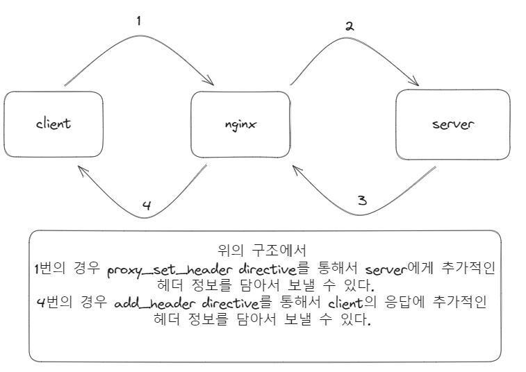
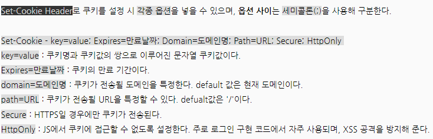

## client <-> nginx <-> server

### nginx directive를 이용해 header를 조작하는 방법

### nginx 단계에서 header를 조작하면 얻게 되는 이점

- 보안: Nginx는 보안 관련 헤더를 추가하여 웹 애플리케이션을 보호합니다. 예를 들어, X-Content-Type-Options 헤더를 추가하여 브라우저에서 MIME 타입을 추측하지 못하도록 하거나, Content-Security-Policy 헤더를 사용하여 스크립트 실행 및 리소스 로드에 대한 정책을 설정합니다.

- 캐싱: Nginx는 캐싱 관련 헤더를 추가하여 클라이언트와 중간 프록시 서버가 캐시를 올바르게 처리할 수 있도록 합니다. Cache-Control, Expires, Last-Modified와 같은 헤더를 사용하여 캐시 동작을 제어합니다.

- 사용자 경험 향상: 몇 가지 헤더는 사용자 경험을 향상시키기 위해 추가됩니다. Content-Disposition 헤더를 사용하여 파일 다운로드에 대한 정보를 전달하거나, Content-Encoding 헤더를 사용하여 압축된 콘텐츠를 제공할 수 있습니다.

- 크로스 오리진 요청(CORS): Nginx는 Access-Control-Allow-Origin과 같은 CORS 관련 헤더를 추가하여 웹 애플리케이션에서 다른 도메인으로부터의 요청을 처리할 수 있도록 합니다.

- 사용자 지정 로깅: 서버 응답에 특정 정보를 추가하면 서버 로그에 필요한 정보를 기록할 수 있습니다. 이를 통해 애플리케이션의 동작 및 성능 모니터링을 수행할 수 있습니다.

- 디버깅 및 분석: 서버 응답 헤더에 추가 정보를 포함하면 디버깅과 문제 해결을 용이하게 할 수 있습니다. 예를 들어, X-Request-ID 헤더를 사용하여 각 요청을 고유하게 식별할 수 있습니다.

- 프록시 및 로드 밸런싱: Nginx가 업스트림 서버로 요청을 전달할 때 헤더를 추가하여 로드 밸런싱 또는 다른 프록시 관련 작업을 수행할 수 있습니다.

### set-cookie-header
