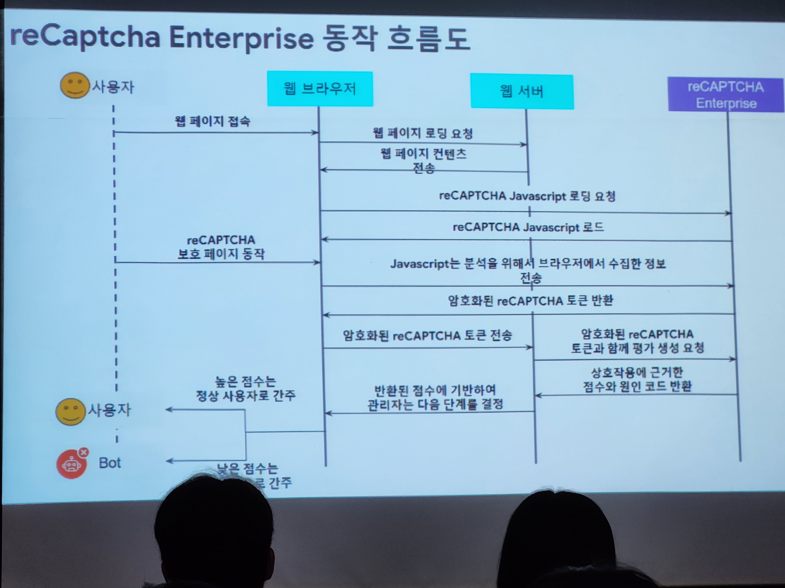

> DB에 대한 정리

몰랐던 개념들
- Graph DB
- Vector DB
- BigQuery 

### 전체적으로 DB에 대한 설명과 구글 bigQeury에 대한 설명 그렇게 유익하지는 않았다.

> AWS 
몰랐단 개념들
- saas

> google security

reCaptcha Enterprise 동작 흐름도에 대한 내용이다.

### 실제 구글에서 보안 파트를 담당하시는 분이 얘기를 해주셔서 좋았다. 

 > 일잘하는 개발자가 되는 법
 
 1. 암묵지 없애기
    ==> (서비스 흐름도, 각종 피처들의 진행사항, 결과 등)
 2. 기술로만 해결하라고 하지 않는다.
 3. "안 된다" 라고 말하지 않는다.
 4. 최적의 피처 방향을 찾는다.
 5. 모든 것을 기록한다.
    ==> "적자생존" 적는 자가 생존한다. ㅋㅋ
 6. 하라는 대로 하지 않는다.    
 7. 일정 공유
 8. 혼자서 다 하려고 하지 않는다.
 9. 인정할 줄 안다.
 10. 명확한 단어와 문장 사용.
 11. TODO / Reminder 사용
 12. 귀찮아 한다.
 13. 회고
    ==> 매달 말에 회고록 적기. 

 > golang package 취약성에 대한 사전 대비

자료: https://github.com/0417taehyun/google-io-extended-2023-seoul-presentation

govulncheck 패키지를 이용해 패키지가 가지고 있는 취약점에 대해서 알고 미리 대비한다.

CLI => IDE => makefile => pre-commit

==================================> 
                            자동화 UP 

### pre-commit에 대해서 알게 되었다. sh으로 만들어서 커밋하기 전에 자동으로 실행하게 만드는 방법이였다.

### 전체적인 한줄평: 좋은 경험이였다. 이상.ㅋㅋ
