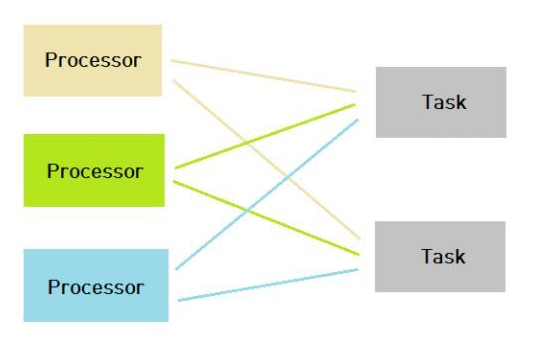

1. 프로세서 
    > CPU나 Microprocessor라는 하드웨어를 의미한다. 
2. 프로세스
    > 실제 메모리에 적재되어 프로세서에 의해 실행되고 있는 프로그램을 의미한다.

> 보통 하나의 프로세서(CPU)가 하나의 작업을 맡지만 멀티 프로세싱은 다수의 프로세서가 다수의 작업을 함께 처리하는 것을 의미한다.

출처: https://sorjfkrh5078.tistory.com/56

### 멀티 프로세싱의 특징 
멀티 프로세싱은 한마디로 말해서 '두개 이상, 다수의 프로세서가 협력적으로 작업을 동시에 처리하는 것' 입니다.

멀티 프로세싱의 장점은 하나의 프로세서가 고장이 나더라도 해당 프로세서가 진행 중인 작업은 다른 프로세서에서 수행하고 있기 때문에 작업이 정지되지 않는다.

​또한, 여러 개의 프로세스가 처리되어야 할 때 동일한 데이터를 사용한다면 각 데이터를 각 프로세서에게 할당할 필요 없이 하나의 공간에 데이터를 저장한 후 이를 공유하여 사용하도록 한다면 비용을 절약할 수 있다.

### 멀티 프로그래밍

하나의 프로세서가 하나의 프로세스를 수행하는 동안 다른 프로세스에 접근 할 수 있게 하는 방법을 의미한다.

### 멀티 태스킹

다수의 작업을 운영체제의 스케줄링에 의해 번갈아 가며 수행되도록 해주는 것을 의미한다. 

프로세서는 특정 순간에 하나의 작업만 수행할 수 있다. 하지만 컴퓨터의 작업속도가 빠르기 때문에 우리 눈에는 한번에 모든 작업들이 수행되고 있는 것 처럼 보인다. 
이를 가능하게 해주는 것이 멀티 프로그래밍, 시분할 방식, 실시간 시스템 방식이다. 

멀티 프로그래밍은 멀티 태스킹 작업을 하기 위해 사용되는 스케줄링의 한 방식이다. 

### 멀티 스레딩

하나의 프로세스를 다수의 스레드로 구분하여 자원을 공유하고 자원의 생성과 관리의 중복성을 최소화하여 수행 능력을 향상 시키는 것을 의미한다.