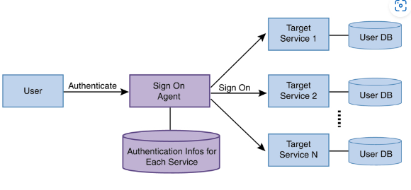
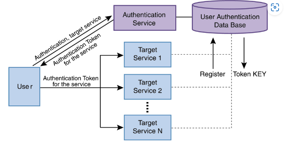

# ***SSO***
> Single Sign-On(SSO)은 1회 사용자 인증으로 다수의 애플리케이션 및 웹사이트에 대한 사용자 로그인을 허용하는 인증 솔루션이다.

## ***sso가 필요한 이유***
> 로그인의 번거로움에서 벗어날 수 있다.

## **SSO의 2가지 모델** 

> **SSO delegation model**

대상 애플리케이션의 인증 방식을 **변경하기 어려울 때 많이 사용**된다. 대상 애플리케이션의 인증 방식을 전혀 변경하지 않고, 사용자의 대상 애플리케이션 인증 정보를 **에이전트가 관리해 사용자 대신 로그온** 해주는 방식이다. 즉 Target Server 1을 로그온 할 때 User1이 alice/alice라는 ID/ PWD가 필요하다면, 에이전트가 이 정보를 가지고 있고, User1이 Target Service 1에 접근할 때 에이전트가 대신 alice/alice ID/PWD 정보를 전달해서 로그온 시켜준다.   

> **SSO propagation model**

통합 인증을 수행하는 곳에서 인증을 받아 대상 애플리케이션으로 전달할 **토큰(Token)을 발급** 받는다. 대상 애플리케이션에 사용자가 접근할 때 토큰을 자동으로 전달해 대상 애플리케이션이 사용자를 확인할 수 있도록 하는 방식이다. 웹 환경에서는 쿠키(Cookie)라는 기술을 이용해 토큰을 자동으로 대상 애플리케이션에 전달할 수 있다. 이러한 웹 환경의 이점으로 웹 환경에서의 SSO는 대부분 이 모델을 채택하고 있다.